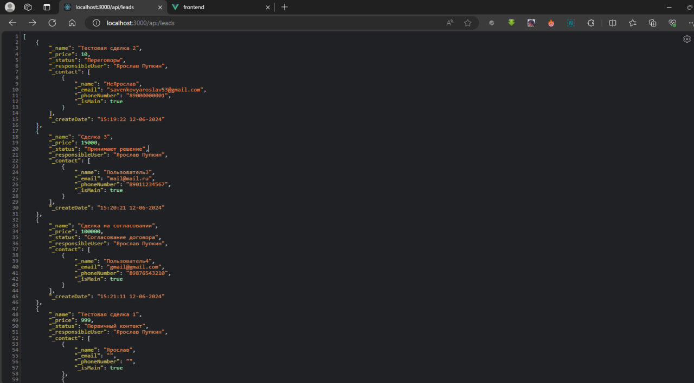
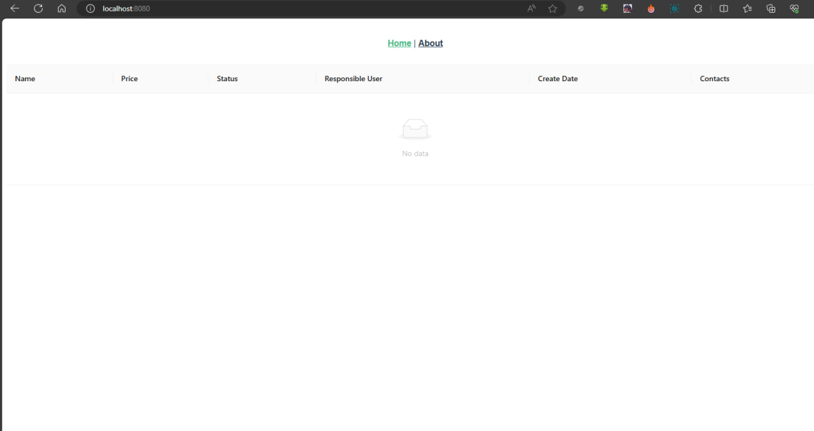

## Running the app

```bash
# start app
$ npm run start:dev

```

# Тестовое задание для JavaScript разработчика


## Получение всех сделок с их контактами, статусами и ответственными лицами
- GET http://localhost:3000/api/leads
- <b>Параметр 'query' :string</b> - производится запрос с учётом введённого фильтра
- Фронтенд (с ошибкой Network error) - http://localhost:8080

